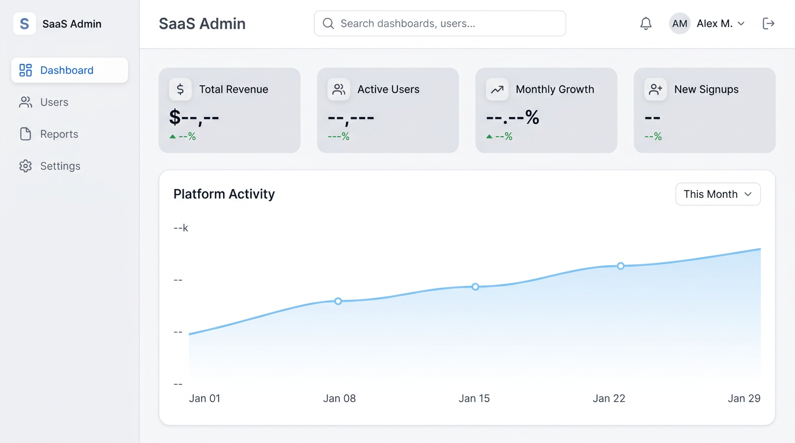
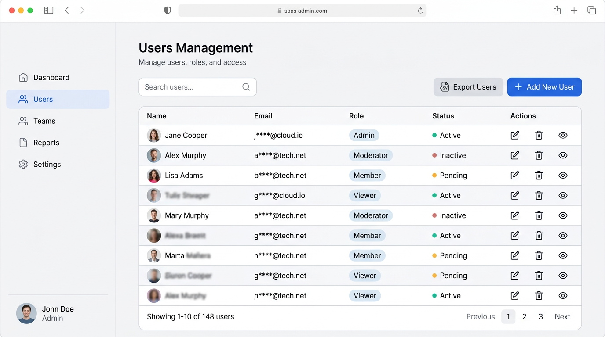
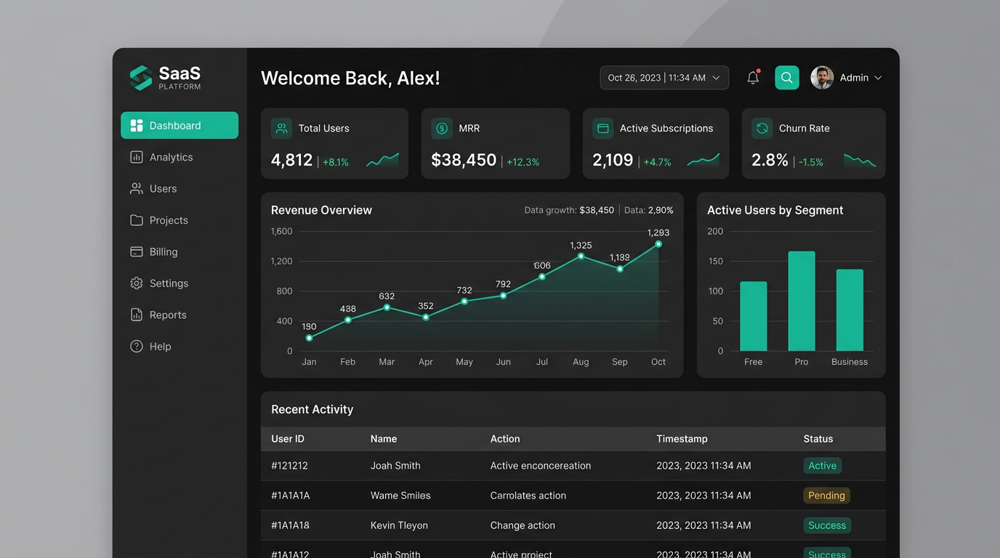

# SaaS Admin Dashboard

A **portfolio-grade admin shell** for a fictional SaaS product: responsive layout, dark mode, accessible navigation, data dashboard with charts, and a users directory with search, sort, pagination, and CSV export.


---

## What this app does

This is a **single-page admin UI** that demonstrates how you’d structure a real SaaS back office:

- **Dashboard** — KPI cards, trend charts (users / revenue), and recent activity fed from static JSON via `HttpClient`.
- **Users** — Sortable, searchable, paginated table backed by `assets/data/users.json`, with **Export users → CSV** (respects current search and sort, UTF‑8 BOM for Excel).

The **main layout** wraps all feature routes: header (menu + theme), collapsible sidebar, and content area.

---

## Tech stack

| Layer | Choice |
|--------|--------|
| Framework | **Angular 21** (standalone components, signals, lazy routes) |
| Language | **TypeScript 5.9** |
| Styling | **Tailwind CSS v4** + CSS custom properties (light/dark tokens) |
| Charts | **Chart.js** + **ng2-charts** |
| HTTP | **Angular `HttpClient`** (demo data from `assets/`) |
| Tests | **Vitest** via `@angular/build:unit-test` (`ng test`) |
| Tooling | **Angular CLI 21**, Prettier, PostCSS |

---

## Features

- **Responsive shell** — Sidebar becomes an off-canvas drawer on small viewports; backdrop dismisses the menu; content scrolls independently.
- **Dark mode** — Toggle in the header; preference stored in `localStorage` (`saas-admin-theme`); `class="dark"` on `<html>` with Tailwind-friendly variants; optional early script in `index.html` to reduce flash.
- **Loading UX** — Skeleton placeholders (pulse) on dashboard and table instead of bare “Loading…” text.
- **Data table** — Column sort, debounced search, page size (10 / 20 / 50), pagination with ellipses; horizontal scroll on narrow screens.
- **CSV export** — Toolbar action on Users; RFC‑4180-style escaping; dated filename `users-export-YYYY-MM-DD.csv`.
- **Routing** — `MainLayout` with child routes: `/` (dashboard), `/users`.

---

## Screenshots (static preview)

*(Illustrative mockups—replace with your own captures from `ng serve` if you want pixels that match your machine.)*

### Dashboard

<p align="center">
  
</p>

### Users table & export

<p align="center">
  
</p>

### Dark mode

<p align="center">
  
</p>

**Add your own screenshots:** save PNGs under [`docs/screenshots/`](docs/screenshots/) using the same filenames, or change the paths in this README.

---

## Getting started

**Requirements:** Node.js **20+** and npm (see `packageManager` in `package.json`).

```bash
git clone <your-repo-url>
cd SaaS-Admin-Dashboard
npm install
npm start
```

Open [http://localhost:4200](http://localhost:4200).

### Build (production)

```bash
npm run build
```

Output is under `dist/` (default application builder).

### Unit tests

```bash
npm test
```

Uses Vitest with the Angular unit test builder (`ng test`).

---

## Project layout (high level)

```
src/app/
  core/           # models, theme init, HTTP-backed services
  features/       # dashboard, users page
  layout/         # main layout, header, sidebar, shell state
  shared/         # ui-table, ui-button, badges, charts, csv helper
```

---

## License

No license file is bundled by default—add one (for example MIT) if you publish this repo. Until then, treat it as portfolio / educational source and credit if you reuse it publicly.
